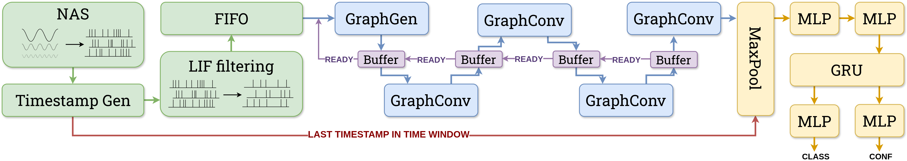

# End-to-End Keyword Spotting on FPGA Using Graph Neural Networks with a Neuromorphic Auditory Sensor

This repository provides the end-to-end FPGA implementation of the keyword spotting system utilising the Neuromorphic Auditory Sensor and Graph Neural Networks as published and presented during the 2026 ARC conference.

<div align="center" style="background-color: white; padding: 10px; display: inline-block;">
  <br>
    <p style="font-size:1.5vw;">The proposed architecture is illustrated with the sensor and filtering modules highlighted in green, the feature extraction stage in blue, and the MaxPool and network head modules in yellow. The scheduling mechanism is marked in purple, while the timestamp propagation mechanism is indicated in red.. </p>
</div>


## Authors

|Name|Role|Contact|Affilation|
|-|-|-|-|
|Wiktor Matykiewicz|Student|wiktor.matykiewicz.03@gmail.com|AGH University of Krakow, Poland|
|Piotr Wzorek|PhD Student|pwzorek@agh.edu.pl|AGH University of Krakow, Poland|
|Kamil Jeziorek|PhD Student|kjeziorek@agh.edu.pl|AGH University of Krakow, Poland|
|Tomás Muñoz|Student|tmunoz1@us.es|University of Seville, Spain|
|Antonio Rios-Navarro|Supervisor|ARIOS@US.ES|University of Seville, Spain|
|Angel Jiménez-Fernández|Supervisor|angel@us.es|University of Seville, Spain|
|Tomasz Kryjak|Supervisor|kryjak@agh.edu.pl|AGH University of Krakow, Poland|

## Getting Started

The project is divided into two parts: Software and Hardware.

### Software

The software part of the project is responsible for training and evaluating GCN models (PyTroch implementation).

### Hardware

The hardware part contains necessary files for implementing NAS/GCNN systems (exact functionality depends on the specific variant) on the FPGA (SystemVerilog/VHDL implementation). The hardware part is located in the `HW` folder. The adopted NAS implementation is generated with [OpenNAS](https://github.com/RTC-research-group/OpenNAS). The FPGA-PC USB interface implementation is generated with [okaertool](https://github.com/RTC-research-group/okaertool). 

### Datasets

Dataset generated and used in this project are available to [download](https://drive.google.com/drive/u/1/folders/152SKPxKCNF28QePVJmLX9s7SXl120Xbq).

### Build

Tcl source files are located in `HW/tcl` folder. By default, project is built in root/vivado folder. There are three project variants available:

1. **NAS + GCNN keyword spotting system** - (TBD)

2. **NAS + okaertool recording system** (`build_nas_rec.tcl`) - builds a project with integrated NAS and okaertool source files. The system receives I2S digital audio input, converts it to AER via NAS and outputs the events using okaertool interface. System was tested with XEM7310-A200 development board.

3. **okaertool + GCNN keyword spotting system** - (TBD)

To generate a project, open the Vivado Tcl Console, navigate to the scripts folder, and source the desired variant, for example:

```tcl
cd <path-to-repo>/HW/tcl
source build_nas_rec.tcl
```

## Citation
If you find this project useful in your research, please consider citing our work:

```BibTeX
@article{matykiewicz2026end,
  title={End-to-End Keyword Spotting on FPGA Using Graph Neural Networks with a Neuromorphic Auditory Sensor},
  author={Matykiewicz, Wiktor and Wzorek, Piotr and Jeziorek, Kamil and Muñoz, Tomás and Rios-Navarro, Antonio and Jiménez-Fernández, Angel and Kryjak, Tomasz},
  booktitle="Applied Reconfigurable Computing. Architectures, Tools, and Applications",
  publisher="Springer Nature Switzerland",
  address="Cham",
  pages="119--136",
  year={2026}
}
```
